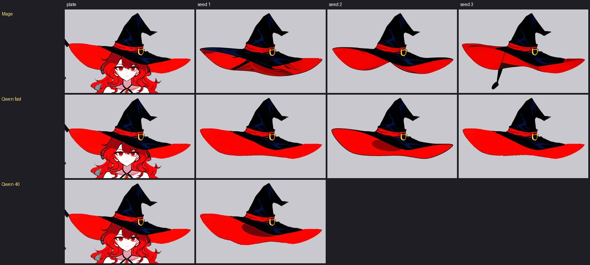
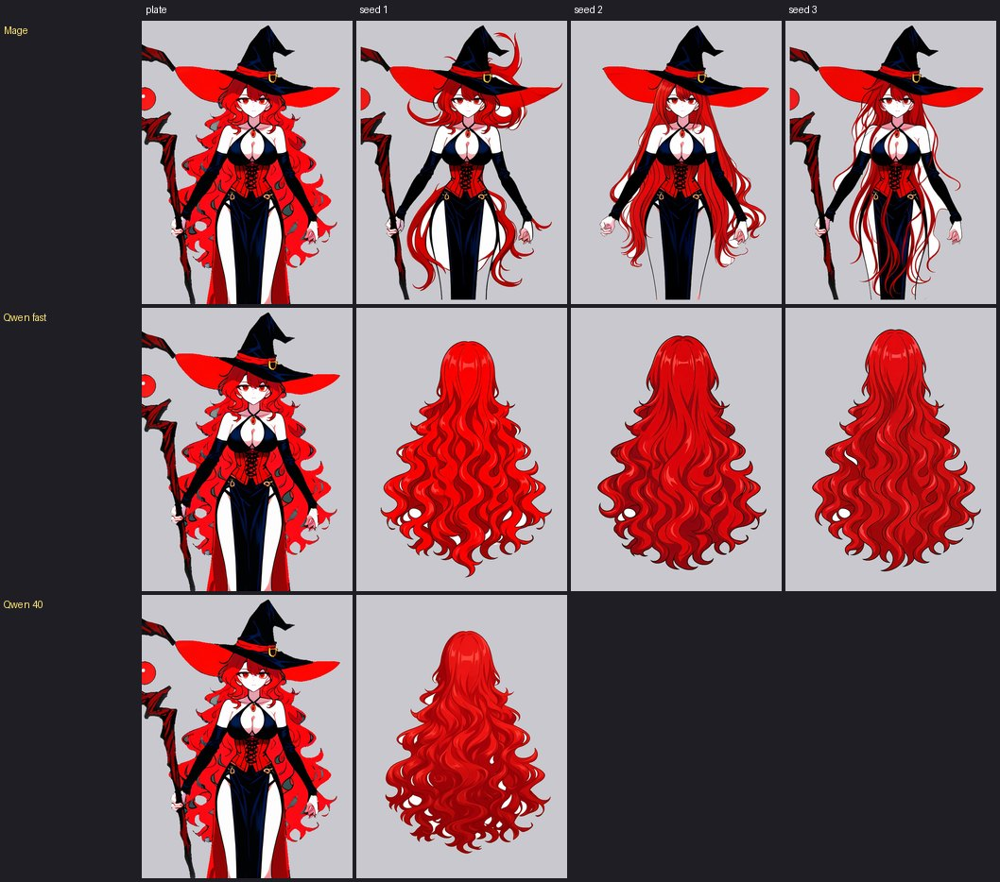
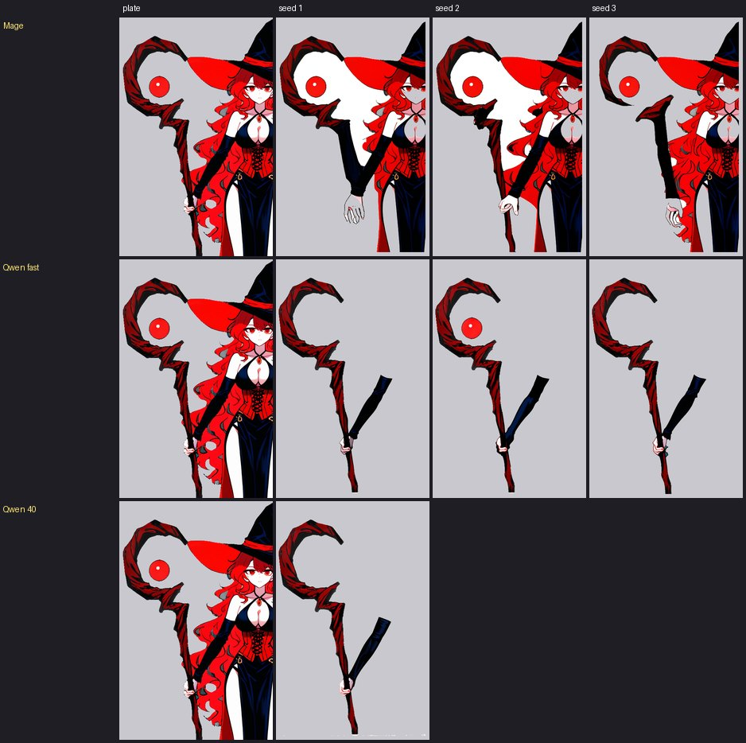
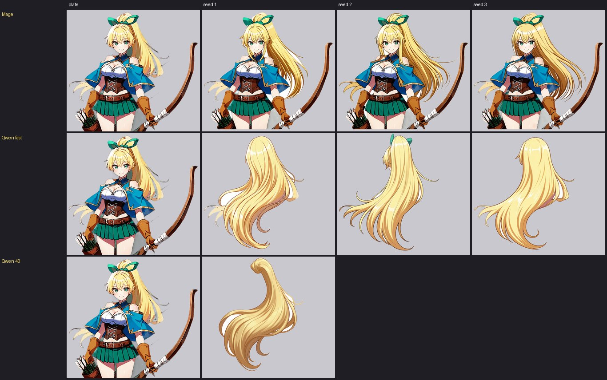
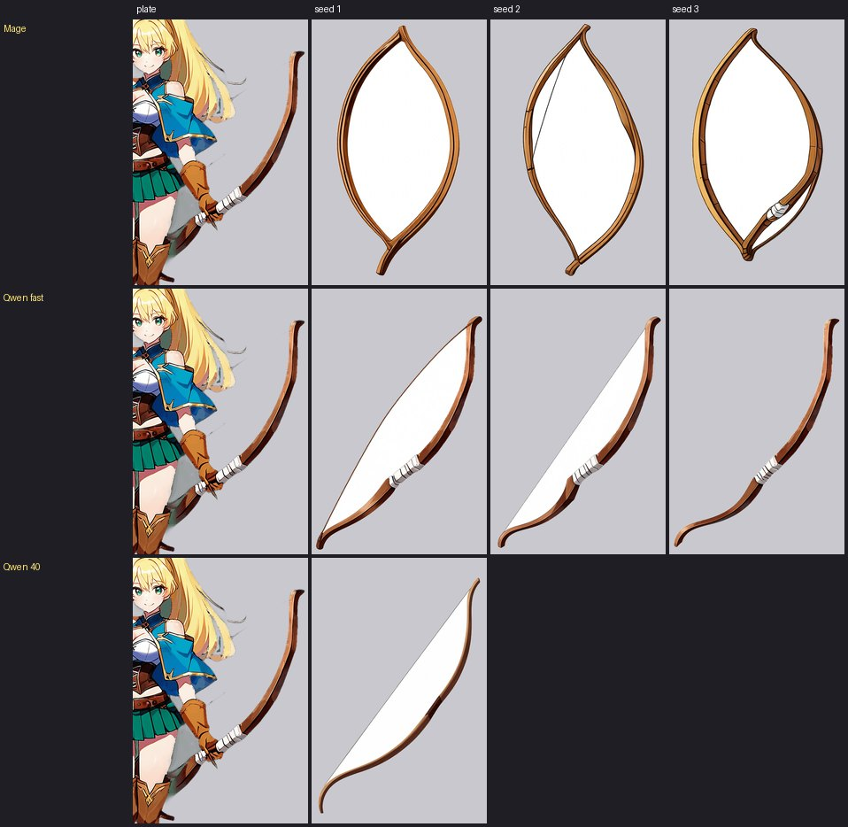
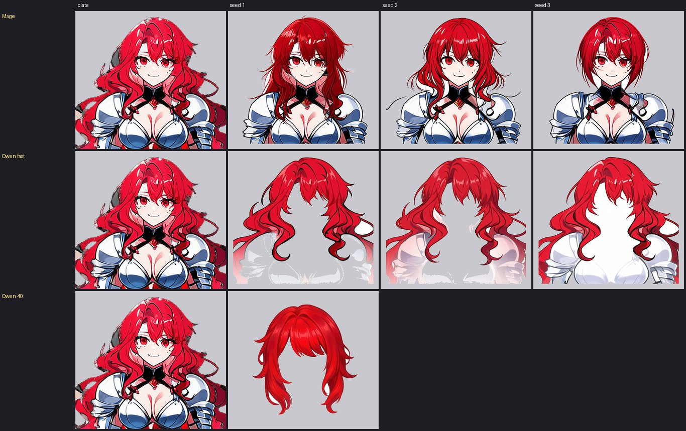
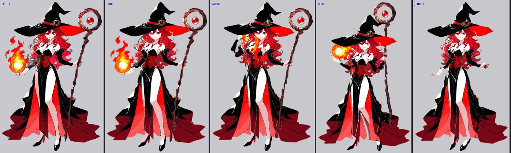
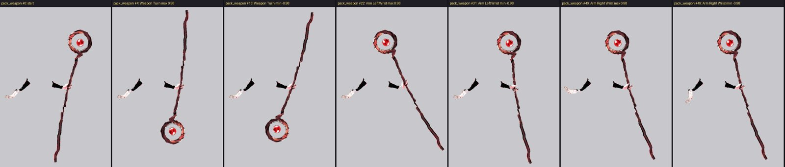

# 物件改用 AI 重畫：可行性研究（explore 分支，2026-10-02）

使用者的想法：不修補拆層模型拆出來的圖層，而是照拆層得到的「整體 → 部件 → 物件」結構，叫 AI 根據物件描述、以立繪為參考，把每個物件重新畫出來，再組裝、驗證可動性。

## 流程

1. 選立繪。
2. 照現在的方式拆圖層，得到 整體 → 部件 → 物件 三層結構（物件的位置、範圍、名稱）。
3. 每個物件交給 AI：「畫出這張圖裡的帽子」，立繪當參考，白底。
4. 組裝生成的物件。
5. 驗證可動性。

## 試過的方法

### 一、現有的繪圖模型（WAI＋角色微調＋萬用控制模型）：不可行

`Tools/art/object_gen.py`：照描述在白底上畫整個物件，用原圖這個物件的線稿（形狀）和顏色當參考。

- 照描原圖：拆層混進來的兩撮頭髮也畫出來，錯誤一起抄。
- 被擋住的地方沒補（帽簷被臉擋住的那段還是缺）。
- 背景不是白的，去背失敗。
- 原因：這種模型只依提示詞作畫，不懂「畫出這張圖裡的帽子」；不給原圖不知道物件在哪，給了就照抄。

### 二、照指令修圖的模型 Mage-Flow-Edit-Turbo：可行，有條件

`Tools/art/object_edit.py`：微軟 Mage-Flow-Edit-Turbo（4B，int8，4 步），ComfyUI 原生節點（範本 `image_mage_flow_edit_turbo_int8`），文字模型 `qwen3vl_4b_fp8_scaled`。下載約 9.75 GB（2026-10-02 使用者同意）。一張約 3 秒（RTX 5060 Ti 16GB）。

把立繪裁成物件附近的範圍交給它，下指令（「只畫出巫師帽，去掉女孩、頭髮和其他東西，畫出被頭擋住的部分，放在純白背景上，保持位置、大小、形狀、顏色」），輸出跟輸入一樣大，白底去掉放回原位。

| 物件 | 結果 |
|---|---|
| 帽子 | 三張都乾淨完整：帽簷補成完整的橢圓、混進來的頭髮沒了、純白背景。帽冠的位置大小幾乎跟原圖一樣；帽簷角度有偏差（左邊帽簷尖較低，前緣垂到眼睛前面）。跟原拆層帽子重疊 62%。 |
| 右手臂（披風黏住那隻） | 乾淨完整的整隻手臂（肩、手套、手），披風和法杖都去掉了；但把手臂拉直成垂下的姿勢，沒有照原圖的角度；肩膀皮膚偏粉紅。 |
| 後髮（大半被身體擋住） | 很好：整片長捲髮的背面，紅色和線條跟芙蕾雅一致（陰影比原圖細）；放在人物後面，輪廓幾乎貼著原圖頭髮的輪廓，只有 2% 超出人物。有一張畫出了臉，不能用。 |

## 結論

使用者的流程**可行**，而且解決了現在修補流程最難的三件事：被擋住的部分（AI 直接畫完整）、混進來的別的東西（AI 只畫指定的物件）、去背（純白背景）。代價是 AI 畫的不是原圖的逐點複製，所以第 4 步「組裝」要多一個**對位**的步驟：

- **頭髮、帽冠這類位置相對固定的物件**：生成的位置已經很準，直接用，或用原物件的範圍微調縮放、平移。
- **四肢**：AI 會畫成拉直的完整手臂、腿。照骨架切成上臂／前臂／手，再依原圖的骨頭角度轉到位。這反而比現在拆出來的零件乾淨。
- **穿過人物的物件（帽子）**：AI 畫的是完整的一頂帽子，組裝時還是要依原圖拆成前後兩層；帽簷角度跟原圖不同的地方，要用原圖的輪廓修正，或接受小差異。
- **風格**：顏色和線條大致一致，細節（陰影、膚色）會略有不同；可以用原圖顏色做一次調色對齊。
- **一個物件生成三張挑一張**，挑選可以交給 Gemma 4 之類的看圖模型自動評分，再給人確認。

## 實作：芙蕾雅整張用 AI 重畫（2026-10-02 下午）

另開一份資料夾 `live/freya/pose_apose_gen`（從修補版複製），修補版 `pose_apose` 原樣保留，兩版並排比較。

**放置工具** `Tools/art/object_place.py <hero> <series> <gen.png> --as <圖層> [...]`：

- `--merge`：**看得到的用原圖、看不到的用 AI**。原圖顯示的像素（現在的圖層和 `_orig` 原版裡跟 full.png 一樣的）一律保留原圖；**後面的圖層在原圖上看得到的地方，這一層要留空**（不然裙子會把開衩裡的腿蓋住）；其餘才用 AI 畫的。
- `--fit`：AI 畫的跟原物件對位：在 ±40 像素、0.85～1.15 倍、±12 度裡找重疊最多的位移、縮放、旋轉（法杖從重疊 31% → 68%，杖身才會穿過握點）。
- `--front`：穿過人物的物件拆前後兩層：原圖上真的蓋在臉、瀏海上的部分（看得到的像素，不含補畫的）放前面。
- `--bones`：整隻手臂依骨架分給上臂、前臂。`--clip-above`、`--no-skin`：裁掉多畫的上衣、開衩裡的腿。

| 物件 | AI 生成（每個 3 張挑 1） | 放法 | 結果 |
|---|---|---|---|
| 後髮 | 3 張都完整，第 3 張平塗最像原圖 | 合併＋對位 | 身體後面、帽子底下都是真的頭髮，甩頭時不破 |
| 前髮 | 只有第 2 張照指令（沒有帽子和臉的完整瀏海、頭頂） | 合併＋對位 | 帽子底下的頭頂補齊 |
| 帽子 | 3 張都完整 | 合併＋拆前後 | 帽簷照原圖、被擋住的地方用 AI 的 |
| 法杖 | 3 張都完整，杖身被手擋住那段也有 | 對位（含旋轉） | 完整一根，杖頭彎鉤比原圖捲一點 |
| 裙子＋披風 | 第 1 張完整（另兩張帶頭髮、畫成褲子） | 合併、裁掉上衣、去掉腿 | 披風被頭髮擋住的上半段補齊；腿照樣從開衩露出來 |
| 右手臂 | 第 1 張保持了原圖的斜角 | 依骨架切 | **失敗**：對位縮成 0.82 倍，上臂碰不到肩膀、變成浮著的白塊；AI 畫的張開的手跟握拳的手重複 → 改回修補版（左手臂鏡像） |

綁定後十個標準動作（不拿武器、拿法杖）都沒有缺參數；跟修補版並排，頭髮更飽滿（身體後面、帽子底下是真的頭髮），其餘差不多。

**結論**：「AI 重畫為主、修補為輔」可行。頭髮、帽子、武器、裙子這類東西 AI 畫得比修補好（被擋住的部分是真的畫出來，不是猜的顏色）；四肢目前還是修補版好（AI 會改姿勢、對位不準）。

## 再兩張：艾莉西亞主設計、芙蕾雅 skin C（2026-10-02 傍晚）

從立繪開始整套跑：姿勢偵測 → 嘴型 → 拆層 → 切零件 → 分包 → 修補＋AI 重畫 → 綁定 → 標準動作（不拿武器、拿武器）。兩張十個動作都沒有缺參數，武器驗證都通過。

途中修的工具（這兩張才遇到）：

- `rig_parts.py` 要工作資料夾裡有 `full.png`：主設計、服裝的立繪在遊戲素材裡，要先複製過去。
- **腿沒切**：切腿要膝蓋、腳踝，原本只從關鍵姿勢的 `pose.json` 拿；主設計、服裝沒有 → `live_layers.py parts` 也存偵測到的膝蓋、腳踝，`rig_parts.py` 沒有 `pose.json` 時用它們。
- `see_through.py --rebuild`：不用顯示卡，把存下來的拆層結果重新放回立繪（切零件之前的狀態），改了切零件的規則可以重來。
- **姿勢偵測抓錯**（芙蕾雅 C 的盔甲：右手腕沒找到、左手肘手腕放在肩膀上）：我看圖手改 `fig_joints.json`（原本的存成 `fig_joints_dwpose.json`）。握點也常抓錯（艾莉西亞抓到箭筒那隻手），看圖改 `parts.json` 的 `grip`。
- SAM2 切武器沒有反向點會出錯：`--not` 至少給一個點。
- **拆層漏了臉**（芙蕾雅 C）：`object_fix --make-face`（臉的橢圓裡取原圖皮膚，下巴以下切掉、靠下巴那段不比看得到的皮膚寬）；`--split-lr`（兩隻眼白在同一層：從臉中線切開，只有一隻就以兩個虹膜的中點鏡像補另一隻）；`--drop-part`（拆層自己發明的帽子）。
- **手跟箭筒黏在一起**（艾莉西亞的右手放在箭筒上，被當成手，跑步時箭筒跟著手甩）：從手切出來另成 `quiver`，掛在身體上。
- 移動的零件上的小碎點會跟著飛：`--drop-specks 80`。

AI 重畫這兩張的結果：

| | 用了 | 沒用（退回修補） |
|---|---|---|
| 艾莉西亞 | 前髮、裙子 | 後髮（每張都畫進一張臉，對位又歪）、弓（AI 畫的弓弧方向相反、弦跟弓之間的白色去不掉、穿不過握點 → 用修補版補縫、把被腿擋住那段接上） |
| 芙蕾雅 C | 後髮、長劍、披風 | 前髮（三張都沒照指令，人還在） |

規律：**頭髮、披風、武器（直的）AI 畫得好；跟原圖角度不同的彎武器、四肢、會被畫進臉的東西，修補比較穩。**

`object_place.py --fit --wide`：旋轉 ±40 度、位移 ±100 像素、也試左右翻轉（弓弧方向相反時）。

已知小問題：艾莉西亞跳躍時兩條小腿會交叉（她站得窄，膝蓋往內彎就碰在一起，芙蕾雅站得寬沒有）；AI 畫的封閉白色區域（弓弦內側）去背去不掉。

## 換模型比較：Qwen-Image-Edit-2511 vs Mage-Flow-Edit-Turbo（2026-10-02 深夜）

`object_edit.py --engine qwen`（ComfyUI 範本 `image_qwen_image_edit_2511` 攤平；主模型用 Q4_K_M 的 .gguf，要裝 ComfyUI-GGUF；文字模型 `qwen_2.5_vl_7b_fp8_scaled`）。`--fast`：加 Lightning 外掛，4 步；不加是 40 步。下載約 23.7 GB（使用者同意）。

六個物件，**同一句指令**（「除了 X 全部去掉，畫出完整的 X，含被擋住的部分，單獨放在純白背景上，位置、大小、形狀、角度、顏色照原圖；不要人、臉、別的頭髮、別的東西」），每個三個種子。圖：每列一種模型，最左是原圖，灰底是去背後的結果，放在原圖位置。

| | Mage（4 步） | Qwen 快速（4 步） | Qwen 40 步 |
|---|---|---|---|
| 一張多久（RTX 5060 Ti 16GB） | 約 3 秒 | 約 48 秒 | 約 8 分鐘 |
| 照指令只畫物件 | 18 張只有 6 張（帽子、弓；其餘四個物件整個人留著） | 18 張都去掉了人 | 6 張都去掉了人 |
| 位置、大小照原圖 | 照（因為整個人留著） | 帽子、弓照；頭髮常被放到中間、變窄 | 偏得更多（頭髮都被放到中間） |
| 能直接用（含對位後） | 帽子 3 張 | 帽子 3、後髮 3（要對位）、弓 1 | 帽子 1、前髮 1（要對位） |

40 步版太慢（18 張要兩個半小時），只跑每個物件的種子 1。

### 1. 芙蕾雅的帽子

- Mage：三張都完整，但第 3 張多一條黑色尾巴，第 1 張帽簷內側亂。
- Qwen 快速：三張都乾淨完整，帽簷補成完整弧形；帽簷比原圖平一點，帽冠上的藍色反光少了。
- Qwen 40 步：跟快速版差不多，帽簷下多一塊暗紅陰影。

### 2. 芙蕾雅的後髮

- Mage：**三張都沒照指令**，整個人重畫（換了姿勢、頭髮變直）。
- Qwen 快速：三張都是**只有後髮**的完整一片長捲髮，顏色、線條跟芙蕾雅一致；但被放在畫面正中、比原圖窄，**位置和大小沒照原圖** → 要靠 `object_place --fit` 對位。
- Qwen 40 步：一樣只有後髮、完整，形狀比快速版窄長，也在正中間。

### 3. 芙蕾雅的右手臂

- Mage：手臂畫出來了，但人、帽子、法杖都還在，手臂後面留一大塊白。
- Qwen 快速：人去掉了，但**法杖留著**（握在手裡，被當成手臂的一部分），手臂只剩前臂和手、上臂沒畫出來。兩邊都不能直接用；四肢仍以修補版為主。
- Qwen 40 步：跟快速版一樣（法杖留著、沒有上臂）。多跑步數沒幫助。

### 4. 艾莉西亞的後髮

- Mage：**三張都沒照指令**，整個人留著。
- Qwen 快速：三張都只有頭髮，畫風、顏色對；但畫成**側面看的一束長髮**（第 2 張還帶髮帶），跟原圖身體後面那片的形狀不同，要對位、可能要裁。
- Qwen 40 步：只畫成一條馬尾，比快速版更不像原圖。

### 5. 艾莉西亞的弓

- Mage：三張都畫成**合起來的橢圓**（弓弦畫成另一半弓），中間一大塊白去不掉。
- Qwen 快速：**弓弧方向、角度、握把都跟原圖一樣**；第 3 張乾淨可直接用，第 1、2 張弓和弦之間的白色區域去不掉（封閉的白色）。
- Qwen 40 步：弓的方向對，但弓和弦之間一大塊白去不掉。

### 6. 芙蕾雅 skin C 的前髮

- Mage：**三張都沒照指令**，臉和盔甲都留著。
- Qwen 快速：臉、盔甲都去掉了，瀏海和兩側長髮完整；但身體的位置留下**淡淡的白色殘影**（第 3 張是一整塊白色剪影），去背去不乾淨。
- Qwen 40 步：**最乾淨**：一頂完整的瀏海＋兩側長髮，沒有殘影；但縮小放在中間，要對位。

### 小結

- **Qwen 比 Mage 會聽指令**：Mage 只要物件被人擋住一大片（頭髮、手臂），就把整個人重畫；Qwen 18／18 都只畫了物件。這正是之前「後髮每張都畫進一張臉」、「前髮三張都沒照指令」的原因，換 Qwen 就解決了。
- **Qwen 的代價是位置**：看不出物件原本範圍的時候（頭髮），它會把物件畫成「一張完整的頭髮商品圖」放在中間。帽子、弓這類輪廓清楚的就照原圖位置。→ 用 Qwen 的結果一定要經過 `object_place --fit`（有需要用 `--wide`），比較的是形狀合不合，不是重疊多少。
- **快速 4 步就夠**：40 步慢 10 倍（約 8 分鐘一張），沒有比較好，有時更差（艾莉西亞後髮只剩馬尾）。
- **都還畫不好**：四肢（法杖被當成手的一部分、上臂沒畫）；弓弦內側的封閉白色。這兩樣還是修補版。
- **速度**：Qwen 快速一張約 48 秒，是 Mage 的 15 倍；一個物件 3 張約 2.5 分鐘，一個角色十幾個物件約半小時，可以接受。

**建議**：`object_edit.py` 改用 `--engine qwen --fast` 當預設（頭髮、披風、裙子、帽子、武器），Mage 留著當備用（要它照原圖位置、物件沒被擋住時）。改預設之前，先拿芙蕾雅整張跑一次「Qwen 重畫＋對位＋組裝＋標準動作」確認對位工具處理得了置中的頭髮。

## 芙蕾雅主設計整張跑一次：混合版（2026-10-02 早上）

使用者：「針對芙蕾雅主設計再拆一次看看，用混合版」。資料夾 `live/freya/-`，紀錄 `llm_checks.md`。從找骨架到交付約 1 小時 40 分（08:22～10:00），其中部件動作測試是途中使用者指出漏做後才補的。

左起：原圖、綁定後靜止、揮手、跑步、跳躍。

| 物件 | 做法 | 結果 |
|---|---|---|
| 後髮 | Qwen 快速 3 張挑 1，`--fit --wide` | 完整，紅色、捲度跟原圖一致 |
| 前髮 | Qwen 快速，第二輪 `--pad 0.6` 大框才不被切平；照 AI 原位放 | 瀏海＋兩側捲髮；帽簷以上冒出來的頭頂刪掉 |
| 火球（新物件 `held-r`，綁在右手腕） | Qwen 快速，**舊去背**（rembg 把白光中心挖掉） | 完整，跟著右手 |
| 帽子 | Qwen 快速 3 張＋40 步 2 張；照原圖的框放，帽簷蓋住眼睛 → 中途試過從原圖用 SAM2 切；使用者：物件正確、風格接近就好 → 改回 AI 的帽子，**縮小約 7%、放高**，帽簷停在眼睛上方 | 完整的一頂帽子，比原圖小一點 |
| 右手臂、右腿、右眉毛、右耳 | 左邊鏡像 | 被擋住的那邊補齊 |

學到的（細節在 LessonsLearned 六、八）：

- **物件正確、風格接近就好**：AI 的帽子形狀跟原圖不同，照原圖的框放就蓋住眼睛；用放置的位置、大小解決，不改用原圖切（使用者）。
- **後髮要畫內側**：第一次的 AI 後髮是從背後看的後腦勺；改成「把人擦掉、在原位畫後面那片頭髮的暗色內側」才對（使用者指出）。
- **長髮拆成多片**：前髮切出左右側髮，後髮的髮尾沿著線稿切成 3 片，各自擺動；頭髮的擺動放大 3 倍（原本甩頭時只動幾像素）。帽子、髮帶算頭髮包（使用者）。
- **綁定時不再把 AI 的前髮換成原圖顏色**：原本會把帽簷和臉印進前髮。
- **Qwen 的位置問題**：頭髮被畫成置中、變小；對位時拿拆層弄碎的原物件當目標會被帶歪。放置工具加了 `--box`（看圖量框）。
- **rembg 不是萬用**：弓弦內側這種圍住的白色去得掉，但物件本身的白色（火球的白光）會被挖掉。`object_edit` 預設 rembg，`--matte white` 留著用。
- **部件動作測試抓到整體動作看不到的問題**：法杖黏著黑裙子碎片、補畫層的洞、補畫層蓋住後髮、長法杖跟著手臂甩成橫的（綁定加了長武器保持直立）。

沒解決：腰彎轉到底時長裙各片之間裂開（標準動作沒用到）。

**對「AI 重畫為主」的結論**：頭髮、帽子、手上的東西用 Qwen 快速版重畫，組裝時調位置；四肢仍用修補（鏡像）。Qwen 快速每個物件約 2.5 分鐘，40 步這次沒有一張用上。

## 下一步（建議）

0. 四肢：叫 AI 只畫上臂＋前臂（不含手），對位改成依骨架（肩、肘、腕三點）而不是整體重疊。

1. 做「對位」工具：生成的物件 → 依原物件範圍或骨架對齊到原圖位置。
2. 用芙蕾雅整張跑一次：每個物件都用 AI 重畫，組裝，跑標準動作，跟現在的修補流程版本並排比較。
3. 比較兩種流程的總工時和效果，決定 22b 的甲流程要不要改成「AI 重畫為主、修補為輔」。
