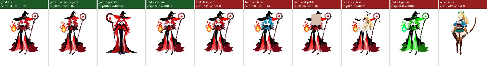
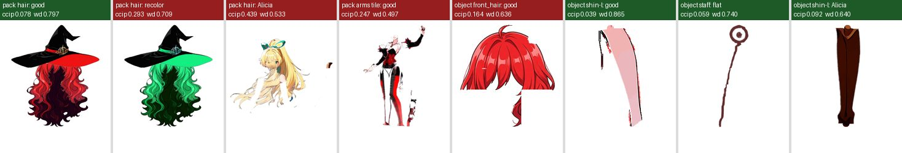

# 「像不像這個角色」的分數：不跟原圖逐點比（similarity-test 分支，2026-10-02）

使用者的問題：組好、動起來的結果，能不能打一個「像不像芙蕾雅」的分數，而不是跟這張立繪一個點一個點比？還有追問：「物件和部件好像沒辦法分開檢驗？」

結論先講：

- **整個人物**：可以。動漫角色辨認模型 `ccip` 把好的結果、壞掉的結果、別的角色分得很開。
- **一包（部件）**：臉、頭髮、衣服這三包可以；四肢、武器、手上拿的東西不行。
- **單一物件**：不行。好物件和壞物件的分數重疊，定不出一條線。
- 所以「部件」可以和整個人物分開檢驗，「物件」還是只能靠看（L4）。

## 做法

把一張圖交給一個看圖的模型，換成一串數字（特徵），再跟**同一個角色的其他圖**的特徵比，取最接近的三張的平均。參考圖**不含正在測的這張立繪**，所以量的是「像不像這個角色」，不是「像不像這張圖」。

試了三個模型，都用 `onnxruntime` 在處理器上跑（不用顯示卡、不用 `torch`），從 Hugging Face 下載，共約 880 MB：

| 模型 | 是什麼 | 分數 |
|---|---|---|
| `deepghs/ccip_onnx`（`ccip-caformer-24-randaug-pruned`，150 MB） | 專門訓練來分辨動漫角色是不是同一個人 | 差距，**越小越像**；它自己的「同一人」界線是 0.178 |
| `SmilingWolf/wd-vit-tagger-v3`（380 MB） | 動漫圖的標籤模型（紅髮、帽子、洋裝……），把一萬個標籤的機率當特徵 | 相似度，**越大越像** |
| `onnx-community/dinov2-base`（350 MB） | 一般用途的看圖模型 | 相似度，越大越像 |

圖的前處理：透明圖放到白底；灰底、棋盤格底的截圖把底色換成白；裁到人物範圍再補成正方形。

工具：`Tools/art/char_score.py`（用法在檔頭）。整個實驗 `python Tools/art/char_score.py experiment <輸出資料夾>`，處理器跑約 9 分鐘（約 800 張次、三個模型）。

另一個想法（同一個繪圖模型加不加角色微調，比較去雜訊的誤差）**沒有做**：第一個方法在整個人物、大的部件上已經夠用；在物件上失敗的原因是小碎片本身沒有角色特徵，換方法也補不回來；而且要用到共用的顯示卡。

## 資料

**要打分數的（芙蕾雅）**

- 好的：主設計今天的模型 `freya/-/_shots` 五張、`_motions_all` 十個動作每十格取一格共 60 張；A 姿勢 `pose_apose_r2`、`pose_apose_r3` 的截圖各五張。
- 壞的（自己做，從 `000_rest`、`090_mouth_open`、`150_settled` 三張截圖改）：頭蓋一塊平色、頭髮改藍色、整個人換色、右手臂換成愛麗西亞的、頭髮和帽子換成愛麗西亞的、臉換成愛麗西亞的。
- 別的角色：愛麗西亞的動作 30 格、她的主設計和十套服裝立繪 11 張、蕾娜和雪乃的立繪各一張。

**參考圖（整個人物）**：芙蕾雅十套服裝的 `full.png` 和 `bust.png`（20 張），加上主設計的關鍵姿勢 `pose_cast`、`pose_idle`、`pose_raise`、`pose_ready`、`pose_recover` 的 `full.png`（5 張）。不含主設計立繪本身、不含任何 A 姿勢。

**參考圖（一包、物件）**：芙蕾雅其他拆好的版本 `C`、`pose_apose`、`pose_apose_r2`、`pose_apose_r3` 裡**同名的物件**，和用同樣方法疊出來的**同一包**。

角色微調用的訓練圖在 `art_work/lora/freya/dataset/3_freya_tdc`（77 張）。沒有用：裡面大概有主設計立繪的變化，會讓分數偏高；服裝和姿勢已經夠。

## 分數

### 整個人物

`ccip` 越小越像，`wd`、`dino` 越大越像。數字是平均（最小～最大）。

| 組別 | 張數 | `ccip` | `wd` | `dino` |
|---|---|---|---|---|
| 好：主設計截圖 | 5 | 0.043（0.042～0.047） | 0.913（0.898～0.920） | 0.798 |
| 好：主設計動作 | 60 | 0.046（0.037～0.056） | 0.910（0.901～0.934） | 0.816（0.777～0.842） |
| 好：A 姿勢 r2、r3 | 10 | 0.032（0.028～0.040） | 0.950（0.941～0.956） | 0.876 |
| 壞：右手臂換成愛麗西亞的 | 3 | **0.038** | 0.900 | 0.817 |
| 壞：臉換成愛麗西亞的 | 3 | 0.141 | 0.885 | 0.814 |
| 壞：頭髮改藍色 | 3 | 0.170 | 0.841 | 0.791 |
| 壞：頭蓋一塊平色 | 3 | 0.236 | 0.859 | 0.740 |
| 壞：頭髮和帽子換成愛麗西亞的 | 3 | 0.285 | 0.710 | 0.806 |
| 壞：整個人換色 | 3 | 0.301 | 0.825 | 0.777 |
| 別人：愛麗西亞的動作 | 30 | 0.415（0.401～0.432） | 0.482 | 0.628 |
| 別人：愛麗西亞的立繪 | 11 | 0.383（0.337～0.414） | 0.617（0.453～0.735） | 0.687（0.412～0.826） |
| 別人：蕾娜、雪乃 | 2 | 0.379 | 0.533 | 0.575 |

- `ccip`：好的最差 0.056，壞的（手臂以外）最好 0.141，別的角色最好 0.337。界線定在 **0.10**，六種壞法抓到五種，別的角色全部抓到，好的全部通過。
- 抓不到：**換掉一隻手臂**（0.038，跟好的一樣）。小地方換掉，整體還是她。三個模型都抓不到。
- `ccip` 自己的界線 0.178 太鬆：頭髮改藍色（0.170）會被當成同一人。要用我們自己的界線。
- `wd`：好的最低 0.898，壞的除了手臂和臉之外都在 0.87 以下；可以當第二意見，但臉換掉（0.885）只差一點。
- `dino`：分不開，愛麗西亞的一張立繪（0.826）比芙蕾雅的動作還像。不採用。
- 只用服裝當參考（不含關鍵姿勢）時，好的分數變差（`ccip` 0.07～0.09），但順序不變：模型認的是人，不只是衣服。

### 一包（部件）

參考：其他版本裡同一包。「疊出來」是把這一包的物件疊在一起；「動作圖」是 `_packs/sheet_pack_*.jpg` 裡的每一格（部件動作測試的截圖）；「組裝」是 `assemble_1`～`6` 左半邊（一包一包加上去）。只列 `ccip`。

| 包 | 好：疊出來 | 好：動作圖 | 壞：換色 | 壞：平色 | 別人（愛麗西亞的同一包） | 分得開？ |
|---|---|---|---|---|---|---|
| 臉 | 0.056 | 0.063～0.079 | 0.163（動作圖換色 0.146） | 0.200 | 0.217 | 可以 |
| 頭髮（含帽子） | 0.078 | 0.077～0.083 | 0.293（0.275～0.282） | 0.179 | 0.439；她的頭髮配芙蕾雅的帽子 0.347 | 可以 |
| 衣服 | 0.084 | 0.045～0.084 | 0.200（0.191～0.214） | 0.279 | 0.284 | 可以 |
| 四肢 | 0.092 | 手臂 0.162～0.247、腿 0.102～0.137 | 0.126（0.138～0.284） | 0.098 | 0.155 | **不行** |
| 武器 | 0.069 | 0.063～0.077 | 0.133（0.121～0.142） | **0.058** | 0.176 | 換色可以，平色不行 |
| 其他（手上的火球） | 0.167 | 0.116～0.162 | 0.221（0.146～0.173） | 0.141 | 0.154 | **不行** |
| 組裝第 1～6 步 | 0.061～0.082 | — | — | — | 0.382～0.423 | 可以 |

- 臉、頭髮、衣服：好的都在 0.085 以下，壞的都在 0.14 以上，界線 **0.10** 分得開。
- 四肢：手臂動作圖本身就有 0.16～0.25（被當成不像），好壞重疊。手腳沒有角色特徵，模型認不出是誰的。
- 武器：換成平色（只剩輪廓）反而更像（0.058）：模型只看形狀。
- `wd` 在一包這一層分不開（好的動作圖低到 0.37，壞的高到 0.88）；`dino` 也不行。

### 單一物件

28 個物件（太小的睫毛、鼻子不算），每個做換色、平色兩種壞的，再拿愛麗西亞同名的物件當別人。

| 組別 | 個數 | `ccip` | `wd` | `dino` |
|---|---|---|---|---|
| 好 | 28 | 0.100（0.039～0.166） | 0.724（0.531～0.905） | 0.593（0.371～0.795） |
| 壞：換色 | 28 | 0.185（0.087～0.366） | 0.649（0.390～0.899） | 0.589 |
| 壞：平色 | 28 | 0.137（0.059～0.246） | 0.615（0.385～0.848） | 0.498 |
| 別人：愛麗西亞同名物件 | 25 | 0.176（0.083～0.348） | 0.640（0.370～0.791） | 0.497 |
| 好的物件，改用整個人物的參考圖 | 28 | 0.249（0.108～0.328） | 0.411 | 0.362 |

- 好的範圍（到 0.166）和壞的範圍（從 0.059 起）大幅重疊，**定不出一條線**。前髮、側髮、手是好的也有 0.16；小腿、法杖換成平色也只有 0.06～0.07。
- 同一個物件「好的比自己的壞版本更像」有 73／81 次，但實際使用時沒有「壞版本」可以比，這個數字用不上。
- 頭髮類物件換色時分數跳很高（0.23～0.37），可是好的頭髮物件本身就到 0.17，界線也不好定。
- 物件拿去跟整個人物的圖比完全不行（好的都在 0.25 左右，跟別的角色差不多）。

## 什麼有用、什麼沒用

有用：

- 整個人物的分數穩：60 格動作（跑、跳、轉頭）都在 0.037～0.056，動作不會讓分數亂跳。
- 頭、頭髮、整體顏色、換人，在整個人物和臉、頭髮、衣服三包都抓得到。
- 不需要原圖：A 姿勢在沒有任何 A 姿勢參考圖的情況下拿到最好的分數（0.028～0.040）。
- 便宜：處理器上一張圖三個模型合計不到 1 秒，不搶顯示卡。

沒用：

- 小地方錯（一隻手臂換掉）抓不到。這種錯還是要靠看（L4、L6b）或跟原圖比。
- 四肢、武器、手上拿的東西這幾包，以及所有單一物件：分數分不開好壞。模型認角色靠的是臉、頭髮、配色、整體服裝；碎片上沒有這些。
- `dino` 三層都不好用；`wd` 只在整個人物這一層能當第二意見。

## 建議：加不加、加在哪裡

1. **加，當成自動的提醒，不當成關卡**：只用 `ccip`，界線 0.10（好的最差 0.056 的兩倍左右；之後多做幾個角色再調）。分數超過就把那張圖標出來，交給 LLM 看；不自動擋下。
2. **整個人物**：L8（`_shots` 五張）、L9 和 L11（動作圖每十格取一格）各跑一次。參考圖用這個角色其他服裝和關鍵姿勢，排除正在做的這張。
3. **一包**：只在臉、頭髮、衣服三包，接在 L6（`assemble_*.jpg`）和 L6b（`_packs/sheet_pack_*.jpg`）。參考圖是同一角色**另一個拆好的版本**的同一包，所以要先有至少一個拆好的版本（芙蕾雅有 `C` 和 A 姿勢；新角色的第一張沒有參考，就跳過）。
4. **物件不加**。回答使用者的追問：用這個分數，「部件」（大的那幾包）可以和整個人物分開檢驗；「物件」不行，還是走 L4 一格一格看。
5. 工作流程引擎的文件（`Docs/Design/23_Workflow.md`）不在這個分支上；等它合進來，可以把第 2、3 點做成 L8、L9、L6 後面的一個自動檢查步驟，結果寫進 `llm_checks.md` 給 LLM 檢查點參考。

## 檔案

- `Tools/art/char_score.py`：`score`（整個人物）、`objects`（物件和包，對同一角色其他拆好的版本）、`experiment`（這份文件的實驗，自己做壞的圖，寫出 `scores.json`）。
- `Docs/Design/img/22d/whole.jpg`、`pack_object.jpg`：上面兩張圖。
- 模型放在 Hugging Face 的快取（`~/.cache/huggingface/hub`），第一次用時自動下載。
