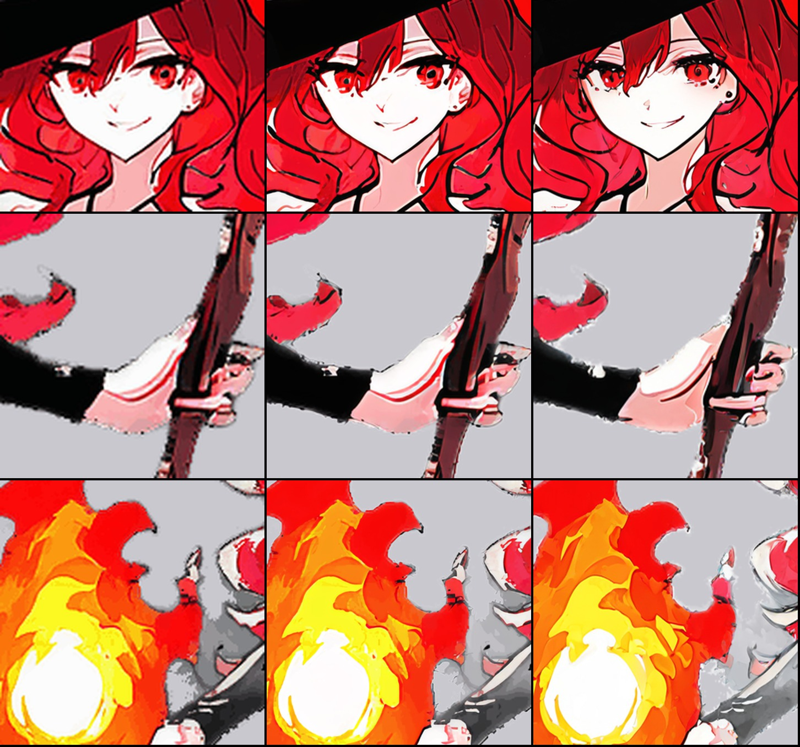
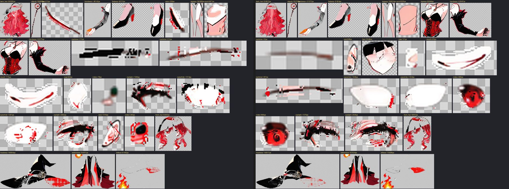

# 放大補細節：對拆層有沒有幫助（2026-10-03 小研究）

使用者的問題：立繪有點糊，放大之後補解析度和細節，能不能讓後面的辨認變好？就算遊戲裡用不到，也有價值。

結論先講：

- **補細節本身有效**：放大兩倍後，用畫立繪的同一個繪圖模型和角色微調低強度重畫一次，眼睛、睫毛、鼻子、耳環、手指的線條清楚很多，還是同一個人、同一個構圖。
- **對拆層沒有明顯幫助**：拆層模型（See-through）在補細節的版本上，臉、眼珠比較完整，但兩耳併成一層、右眉和鼻子幾乎不見；只是單純放大的版本，臉和眼珠反而更差。
- **對骨架偵測是反效果**：原尺寸少抓 3 個關節，放大版少 5 個，補細節版少 9 個。
- 所以：**不要放在拆層之前**。補細節適合用在「給人看」和「給 AI 重畫當參考」的地方（見最後一節）。

## 做法

1. 放大：ComfyUI 的放大模型 `4x-AnimeSharp` 放大 4 倍，再縮回 2 倍（804×1190 → 1608×2380）；透明度另外用一般縮放。
2. 補細節：用 `heroine_j3.img2img`（WAI 模型＋角色微調，和立繪同一套），強度 0.35、30 步，整張一次畫，約 55 秒。

## 拆層比較

同一個種子（42），關節點都用原尺寸手改過的那組乘以 2（偵測的太差，不公平）。像素數換算回原尺寸（除以 4）。

| 圖層 | 原尺寸 | 只放大 | 放大＋補細節 |
|---|---|---|---|
| 臉 | 3468（上半是帽帶） | 153（只剩一條線） | 7986（整張臉，頂上還是帽帶） |
| 右眼珠 | 160 | 19（一團綠色） | 172 |
| 左眼珠 | 245 | 73 | 214 |
| 右耳／左耳 | 17／377 | 82／329 | 兩耳併成一層 237 |
| 右眉 | 78（一塊黑） | 53 | 8 |
| 鼻子 | 169 | 208 | 30 |
| 前髮 | 13029 | 13140 | 10763 |
| 帽子 | 33963 | 42498（含右邊紅色底面） | 35654 |
| 頭髮、衣服、四肢 | — | 幾乎一樣 | 幾乎一樣 |

- 拆層模型大概在內部把圖縮回固定大小，放大不會讓它看到更多；補細節改變的是線條的樣子，有的物件拆得比較好、有的比較差，沒有一致的方向。
- 原本最麻煩的幾個（臉混帽帶、右眉、右耳、火球散在三層、帽簷底面掉在雜物層）都還在。
- 骨架偵測（DWPose）在大圖上更差，正式流程裡關節點本來就要手改，這一步不受影響。

## 另外注意

- **閉眼那張要一起處理**：睜眼、閉眼分開補細節，兩張的細節會不一樣，眨眼差分是兩張相減，全身都會被當成差異。要用，就只補睜眼那張，閉眼改用「眼睛那一塊」貼回去。
- 補細節是重畫，強度太高會改角色；0.35 看起來安全，沒有試更高。

## 建議用在哪裡

1. **AI 重畫的參考圖**（第 5b 步）：小物件（手、眉毛、耳朵）的參考圖現在是用一般縮放放大到 1024 給 Qwen；換成補細節過的立繪裁出來，Qwen 看到的線條比較清楚，可能畫得更像。還沒測，下一步可以拿左手試。
2. **給人看的檢查圖**：審查包裡的總表、放大圖，用補細節版本會比較好判斷。
3. **不建議**放在拆層、找骨架之前。

工具：這次用的兩支小程式在研究用的暫存資料夾（放大：ComfyUI `ImageUpscaleWithModel`；補細節：`heroine_j3.img2img`），要正式用時再做成 `Tools/art/` 的工具。工作資料夾：`art_work/live/freya/pose_x2`（只放大）、`pose_x2hd`（補細節）。
