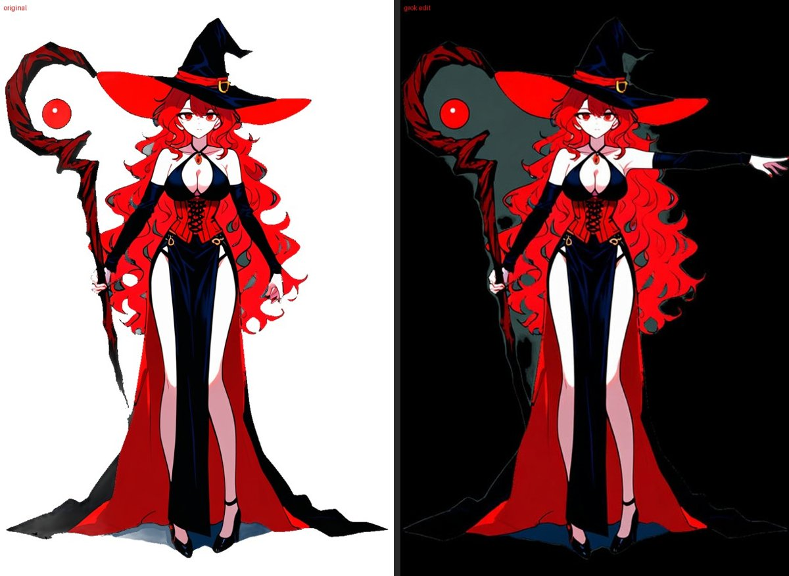
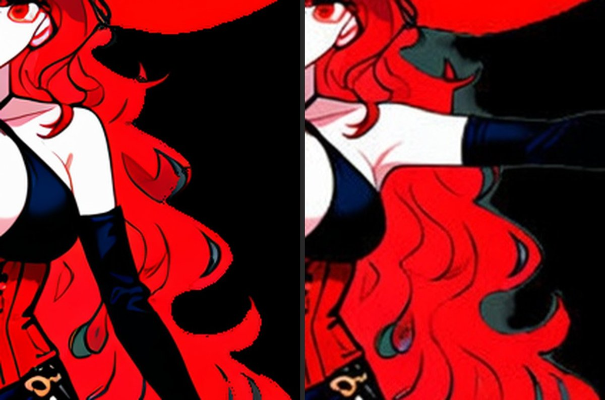

# 手上的模型清點（本機和雲端）

整理日期：2026-10-04。回到 [研究總覽](README.md)。本機的清單是直接看模型資料夾得來的；雲端的價錢見 [06_Image_Blaster.md](06_Image_Blaster.md)「最新模型和官方價目」。

本機顯示卡：RTX 5060 Ti，16 GB，跟美術工具箱共用（用前看 ComfyUI 佇列）。

## 本機

模型都放在 StabilityMatrix 的 `Data/Models`（ComfyUI 和 MV-Adapter 共用），少數放在 ComfyUI 的 `models/` 或外掛的資料夾。大小是磁碟上的檔案大小。

### 1. 畫角色（立繪、關鍵姿勢、局部重畫）

| 模型 | 大小 | 用在 | 備註 |
|---|---|---|---|
| WAI-illustrious SDXL v1.7 | 6.9 GB | 立繪、關鍵姿勢、嘴型、閉眼、局部重畫 | 主力繪圖模型 |
| 角色微調（艾莉西亞、芙蕾雅、蕾娜、雪乃） | 各 0.1 GB | 跟 WAI 一起用，保持長相 | 每位另有一個第 4 輪的中間版 |
| OpenPose 控制（xinsir） | 2.5 GB | 照骨架畫姿勢（`key_poses.py`） | |
| 萬用控制（xinsir union promax） | 2.5 GB | 照線稿重畫 | |
| Fooocus 局部重畫頭、LaMa | 0.2 GB | 補洞、局部重畫 | LaMa 是專門補洞的模型，不會「畫」新東西，只延伸周圍 |
| sd-scripts（訓練工具） | — | 訓練角色微調（一位約 36 分鐘、12 GB） | 美術工具箱在用 |

### 2. 改圖、重畫單一物件

| 模型 | 大小 | 用在 | 備註 |
|---|---|---|---|
| Qwen-Image-Edit-2511（Q4 壓縮版）＋4 步加速 | 13.2＋0.8 GB，文字編碼器 Qwen2.5-VL 7B 9.4 GB | 物件迴圈的 AI 重畫（`object_edit.py --engine qwen --fast`） | 約 48 秒一張；會畫成「一般的樣子」 |
| Mage-Flow-Edit-Turbo | 4.2 GB，文字編碼器 Qwen3-VL 4B 5.2 GB | 物件重畫（較早用） | 會重畫整個人、只有白底 |

### 3. 拆層、分割、去背

| 模型 | 大小 | 用在 | 備註 |
|---|---|---|---|
| See-through 拆層 v0.0.2＋深度 v0.0.1 | 約 13 GB | 流程第 2 步 | Hugging Face 上最新的就是這兩個 |
| SAM2.1 large | 0.9 GB（另有半精度 0.4 GB） | 點選切出物件（武器、粗分層） | |
| rembg：isnet-anime、u2net | 小 | 去背 | 會吃掉屬於物件的白色 |

### 4. 偵測、深度

| 模型 | 用在 |
|---|---|
| DWPose（yolox＋全身骨架） | 讀立繪的關節（第 1 步） |
| Depth Anything V2 Large（1.3 GB） | 深度 |
| 線稿偵測（sk_model、netG） | 萬用控制的線稿 |

### 5. 多角度

| 模型 | 大小 | 用在 | 備註 |
|---|---|---|---|
| MV-Adapter（SDXL，圖轉多角度） | 3.6 GB | `multiview.py`，自己的 Python 環境 | 4 個角度 768 像素；側面可用，背面、另一側不穩；流程中目前跳過 |

### 6. 影片

| 模型 | 大小 | 用在 | 備註 |
|---|---|---|---|
| Wan 2.1 Fun InP 1.3B | 3.1 GB | 給頭尾兩張補中間影格（停掉的乙流程） | |
| Wan 2.2 TI2V 5B | 10 GB | 文字或圖轉影片 | 這個專案沒用過 |
| UMT5-XXL（文字編碼器） | 6.7 GB | 兩個 Wan 共用 | |

### 7. 放大、看圖

| 模型 | 用在 | 備註 |
|---|---|---|
| 4x-AnimeSharp | 放大 | 補細節那條路（已放棄）用過 |
| Gemma 4 e4b（Ollama，9.6 GB） | 看圖寫文字（審圖、寫指令） | 不能跟 ComfyUI 同時放在顯示卡上 |

### 8. 這個專案沒用到的

autismmix SDXL（Pony 系，6.9 GB）、ACE-Step（音樂，約 18 GB）、向量圖示微調、VOICEVOX（語音）：towerD 或美術工具箱的東西，不要動。

## 雲端

| 類別 | 服務、最新模型 | 價格 | 備註 |
|---|---|---|---|
| 改圖、物件參考圖 | Google Gemini 3.1 Flash Lite Image | 1K 約 0.034 美元／張 | 有金鑰，但**外洩過，要先換** |
| | Gemini 3.1 Flash Image | 1K 0.067、2K 0.101 美元 | |
| | Gemini 3 Pro Image | 0.134 美元（4K 0.24） | |
| | OpenAI GPT Image 2.5 | 依字詞計價，約 0.01～0.06 美元 | 分「編輯精準」和「快速」兩版 |
| | xAI Grok Imagine（經 Grok Build 命令列，用 SuperGrok 訂閱登入） | API 每張 0.02～0.08 美元；用訂閱登入時改圖的費用沒出現在使用記錄，可能算訂閱額度 | **2026-10-04 實測過一次**，見下節；批次沒有折扣 |
| 圖轉 3D（含綁骨架） | Meshy 7.1 | 一角色＋10 動作約 1.3 美元（Pro 每月 20 美元） | 免費方案作品要標出處 |
| | Tripo P2.0 | 一角色＋10 動作約 1.55 美元 | |
| | 混元 3D 3.1 Pro（騰訊雲） | 生成＋綁骨架約 0.5 美元，無動作 | 新用戶送 1,000 點 |
| 拆層 | Qwen-Image-Layered | 公開模型，本機原版 200 億參數放不下 16 GB | 要壓縮版或雲端；沒裝 |
| 拆層＋自動綁定 | Bunraku | 拿不到 | 要寫信申請 |

## 實測：Grok Build 改圖（2026-10-04）

**安裝和設定**
- 官方命令列工具 Grok Build（指令 `grok`，測試時 1.0.46）。Git Bash 安裝：`curl -fsSL https://x.ai/cli/install.sh | bash`，裝在 `~/.grok/bin/`；`grok login` 用訂閱登入（存在 `~/.grok/auth.json`）。
- 有三個圖像工具：`image_gen`（文字生圖）、`image_edit`（改圖，可以給本機檔案的絕對路徑當參考圖）、`image_to_video`（圖轉影片）。
- 非互動模式：`grok --allow image_edit -p "<指令>"`。不給 `--allow` 時改圖會因為沒有權限被取消；只開放 `image_edit`，不要用 `--always-approve`（會放行所有指令）。
- 輸出存在 Grok 自己的工作階段資料夾 `~/.grok/sessions/<工作資料夾>/<工作階段>/images/1.jpg`，要自己複製出來；費用記錄在同一個資料夾的 `usage.json`。

**測試**：芙蕾雅的 A 字站姿（`art_work/live/freya/pose_apose/full.png`，832×1216，透明背景），指令「畫面右邊那隻手（她的左手）往側邊平舉到肩膀高度，其他全部不要改」，改一次，約 23 秒。

**結果**
- 做到的：
  - 手照指令水平舉起，袖子、手套對，接在肩膀上自然。
  - **原本被手臂擋住的地方補得合理**：補出跟旁邊接得起來的紅色長髮，腋下、身體側面也對。
  - 束腹、露肩的服裝**沒有被內容審查擋下**。
- 問題：
  1. **整張重畫**：每條線都移了一點，身上約 14% 的像素差異明顯（每個顏色差超過 40）；臉變糊、線條移位、眼睛略變。「其他不要改」沒做到。
  2. **尺寸變了**：832×1216 → 832×1232，縮放回原尺寸對得最準。
  3. **沒有透明**：輸出 JPG；透明背景被當成黑色，頭髮間透明的縫變成深灰色也照畫。
- 費用：`usage.json` 只記了程式助手模型（grok-4.7-build）3 次呼叫、約 6.5 萬字詞單位，費用欄 `326964400`（單位沒寫，若是百億分之一美元約 0.03 美元）；改圖本身沒出現在記錄，可能算在訂閱額度，由使用者看訂閱額度確認。

**怎麼用**：可以當「被擋住的部分」和新姿勢的來源，不能直接當成品。做法：輸入先墊白或灰底；結果縮回原尺寸；只取改動的區域（手臂新位置加上原本手臂的位置），其他用原圖蓋回去（跟 [05_Mesh_Avatar_Studio.md](05_Mesh_Avatar_Studio.md)「遮罩外有變就退件」同一個原則）。

## 推薦

照我們目前「一步一步來、原圖的像素盡量不動」的方向：

1. **先用本機、不花錢的做下一步。** 「A 字站姿 → 局部重畫把手舉起來」只需要 WAI＋角色微調＋OpenPose 控制＋局部重畫，全部都有。先證明這條路能保住原圖、拿到被擋住的部分。
2. **物件重畫換更強的模型，小量試**（Grok 已經試過一次，見上節：補被擋住的部分不錯、不會被審查擋，但會整張重畫，要貼回原圖）。本機 Qwen 快速版的問題（畫成一般的樣子、比例不對）是模型能力的上限。建議先換掉外洩的金鑰，用 Gemini 3.1 Flash Image 試最難的幾個物件（帽子、手、後髮內側），每張不到 0.1 美元，十幾張就能判斷值不值得。
3. **3D 方向用免費額度先摸底。** 用混元 3D 官方送的 1,000 點，或 Meshy 首月半價（10 美元），拿芙蕾雅的 A 字站姿做一個帶骨架的模型，只看兩件事：長得像不像她、動漫的臉撐不撐得住。不像就不往下投入。
4. **不建議：**
   - 本機跑 Qwen-Image-Layered、混元 3D 2.1、TRELLIS.2：顯示卡不夠。
   - 等 Bunraku：拿不到。
   - 再訓練新模型：等前三步有結果，知道缺的是什麼再說。
5. **可以順便整理的**：Wan 2.2（10 GB）和 Mage-Flow-Edit（4.2 GB＋5.2 GB）目前沒在用，但跟美術工具箱共用，要刪之前先問那邊。
